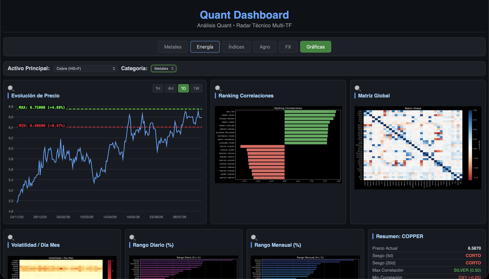

# Quant Dashboard (FX + Macro)

Dashboard de análisis de correlaciones FX y activos macro (metales, energía,
índices, agro), generado como un HTML estático autocontenido. **No requiere
dependencias privadas**: clonar, instalar y generar es todo lo que hace falta.

## Qué incluye

- **Pestaña FX**: tarjetas de los 10 pares mayores con métricas de forma de la
  distribución (Skewness, Kurtosis, Tail Ratio, VaR 95 %, CVaR 95 %), media y
  desviaciones de 50 semanas, carry, Real Yield Differential y probabilidades
  a 12 meses.
- **Pestañas macro**: metales, energía, índices y agro con métricas de panel
  (Sharpe, Sortino, Beta, R², Alpha, probabilidades bootstrap).
- **Gráficas**: dashboard interactivo FX (Chart.js / Plotly).

## Vista previa



## Cómo generar el dashboard

Requisitos: Python 3.11+ (recomendado 3.12–3.14) y conexión a internet para
los datos (Yahoo Finance, FRED opcional).

```bash
# Opción 1 — setup en un paso (venv + dependencias + generar)
bash scripts/setup.sh

# Opción 2 — manual
python3 -m venv .venv
.venv/bin/pip install -r requirements.txt
.venv/bin/python scripts/generar_dashboard.py

# Forzar la re-descarga de todos los datos
.venv/bin/python scripts/generar_dashboard.py --refresh
```

El resultado es `forex_dashboard.html`, un archivo único que puedes abrir en
cualquier navegador o copiar a otra máquina. En Linux, `scripts/launch.sh`
genera (si falta) y abre el dashboard.

Las cards se auto-refrescan: si la caché en `data/` queda por detrás del
último día hábil, se re-descarga sola al regenerar — no hace falta `--refresh`
salvo para forzar una descarga completa.

## API de FRED (opcional)

El Real Yield Differential usa inflación de FRED. Configura tu key en una
variable de entorno `FRED_API_KEY` o en un `.env` . Sin key,
esas filas se muestran como N/A y el carry usa los últimos tipos de reserva
verificados.

## Fuentes

- Precios: Yahoo Finance (`yfinance`)
- Tipos de interés e inflación: FRED (`fredapi`)
